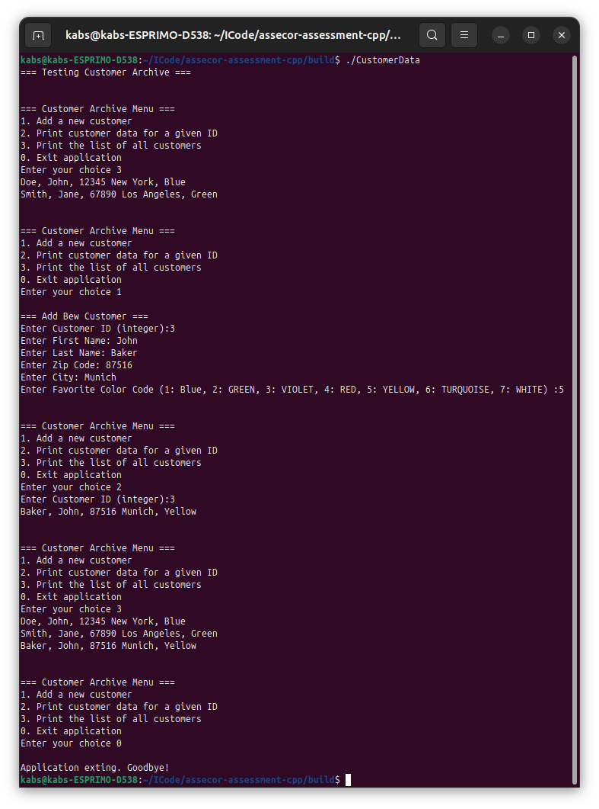

# C++ Developer: Refactoring [customer.h] in C++

## C++ Classes: Customer and CustomerArchive classes

### Requirement

- Cmake, Googletest

If you don't want to use Googletest, remove notified lines in `CMakeLists.txt` (See NoGTest branch)

### Structure of directory

```
ASSECOR-ASSESSMENT-CPP/
├── include/
│   └── customer.h
├── src/
│   └── customer.cpp
├── test_images/
|   ├── CMakeLists.txt 
│   └── CustomerTest.cpp
├── main.cpp
└── CMakeLists.txt
```

### Customer class

The Customer class has the following variables and methods:

- member variables in private: `id_`, `first_name_`, `last_name_`, `zip_code_`, `city_`, `favorite_color_`

- display helper map in private: `ColorNames` display color names in string 

- member methods in public: Contructor, Getters and `dispalyInfo()` 

### CustomerArchive class
The CustomerArchive class has the following variables and methods:

- member variables in private: Use map container for in-memory dataset: `customers_`

- member methods in private: `checkExistID_(int id)`, `getCustomerById_(int id)`, `getCustomerAll_()`, `addCustomer_(const Customer& customer)`

These methods are helper functions to habdle database and have to be modified according to database.

- member methods in public: `addCustomer(const Customer& customer)`, `addNewCustomer()`, `displayAllCustomers()`, `displayCustomerById(int id)`, `displayCustomerById()`

These methods are called in main function.

### main.cpp

Handle console inputs: 

- 1. Add a new customer
- 2. Print customer data for a given ID
- 3. Print the list of all customers
- 0. Exit application

## Building, Running, and Testing

### Building with CMake
```bash
mkdir build 
cd build
cmake ..
make 
```

### Running
In build directory, run the follwong command

``` bash
./CustomerData
```
### Run example	


### Test: Googletest
in build diectory, Run the following comamnd
``` bash
ctest --output-on-failure
```
